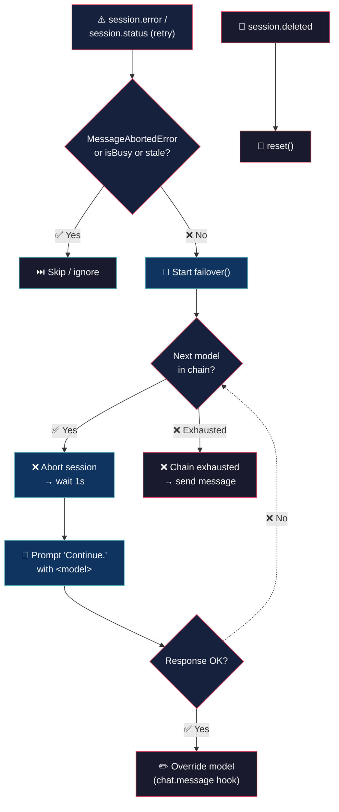

# Model Failover (never stop)


> Estás en medio de algo importante, el modelo falla, perdes el hilo, tenés que reiniciar la conversación, elegir otro modelo, repetirte.

## 💡 What it does

> Los modelos fallan. Tu conversación no.

- **Failover automático** — detecta el error (excepto si vos cancelaste), aborta, agarra el siguiente modelo, le manda "Continue." No te enteraste.

- **Cascada inteligente** — si el segundo también falla, pasa al tercero. Si todos fallan, avisa claro. Sin silencios incómodos.

- **Cero intervención** — no tocas nada. Solo errores reales activan la cascada.

## 🧠 Philosophy

Una sesión muerta es productividad asesinada. Los errores de modelo son esperables — abortás limpio, elegís el siguiente, la charla sigue.

No todos los errores son iguales. `MessageAbortedError` se ignora — vos cancelaste, no es failover. Solo los errores reales importan.

## 🔄 How it works



## 🚀 Install

```bash
cp model-failover.ts ~/.config/opencode/plugins/model-failover.ts
```

No npm, no build step, no dependencies. OpenCode runs TypeScript natively.

## ⚙️ Configuration

Copy `model-failover.json` (included in this repo) to `~/.config/opencode/` and edit:

```json
{
	"enabled": true,
	"chain":
	[
		{ "model": "opencode-go/deepseek-v4-flash", "variant": "max" },
		{ "model": "opencode-go/deepseek-v4-pro", "variant": "medium" },
		{ "model": "deepseek/deepseek-v4-flash-free", "variant": "max" }
	],
	"log_level": "info"
}
```

| Option | Type | Default | Description |
|---|---|---|---|
| `enabled` | `boolean` | `true` | Master switch. |
| `chain` | `object[]` | `[]` | Ordered model entries `{ model, variant? }` where `model` is `"providerID/modelID"`. Variant can be `max`, `high`, `medium`, `low`, etc. |
| `log_level` | `string` | `"info"` | `"silent"`, `"error"`, `"info"`, or `"debug"`. |

## 🪵 Logs

`~/.config/opencode/model-failover.log` (append-only). Format: `[ISO_TIMESTAMP] [LEVEL] message`.

```bash
tail -f ~/.config/opencode/model-failover.log
```

```log
[2026-07-05T10:30:00.000Z] [INFO]: Config loaded
[2026-07-05T10:30:01.000Z] [INFO]: Loaded: 3 models, enabled: true
[2026-07-05T10:35:22.000Z] [INFO]: Trying 0: opencode-go/deepseek-v4-flash
[2026-07-05T10:35:25.000Z] [INFO]: Override: opencode-go/deepseek-v4-flash
[2026-07-05T10:36:00.000Z] [INFO]: Current model: providerID/modelID
[2026-07-05T10:40:00.000Z] [INFO]: Trying 1: opencode-go/deepseek-v4-pro
[2026-07-05T10:40:00.000Z] [INFO]: Chain models exhausted
[2026-07-05T10:40:01.000Z] [ERROR]: Cascade error for sid_abc: connection refused
[2026-07-05T10:45:00.000Z] [DEBUG]: Prompt aborted for opencode-go/deepseek-v4-pro, stopping cascade
[2026-07-05T10:50:00.000Z] [DEBUG]: Stale skip: 304 (override active)
```

## 📖 Behavior

| Event | Reaction |
|---|---|
| `session.error` (any status code) | Immediate failover — abort session, pick next model, re-prompt with "Continue." |
| Error during failover cascade | Logged and advances to the next model in the chain. Stale `session.error` events dropped by `isBusy` guard. |
| `MessageAbortedError` | Ignored. |
| Failover `prompt()` fails | Error logged, cascade advances to the next model. |
| Chain exhausted | "❌ Failover chain exhausted" sent to session. |
| User switches model via `/models` | Respects user's choice; next `session.error` restarts cascade from the beginning. |

## 💬 Notes

Less is more. :)

## 👤 Authors

- Alejandro Carraretto
- DeepSeek-V4

## 📄 License

MIT — version 1.0.32
