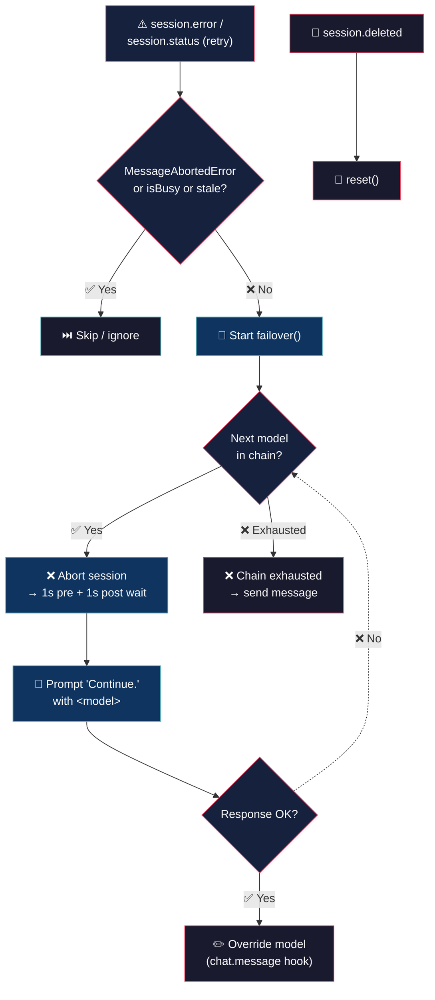

# Model Failover (never stop)


> You're in the middle of something important, the model fails, the task gets interrupted, you lose the thread. You have to pick another model, restart the flow. And if you leave it running and go to sleep? Time wasted, everything wrong. Not anymore!

## 💡 What it does

> Models fail. Your conversation doesn't.

- **Auto failover** — detects the error (except if you cancelled), aborts, grabs the next model, sends "Continue." You never noticed.

- **Smart cascade** — if the second one also fails, it moves to the third. If all fail, it says so clearly. No awkward silence.

- **Zero intervention** — you touch nothing. Only real errors trigger the cascade.

## 🧠 Philosophy

A dead session is murdered productivity. Model errors are expected infrastructure — you abort cleanly, pick the next one, the conversation continues.

Not all errors are equal. `MessageAbortedError` is ignored — you cancelled, not a failover. Only real errors matter.

## 🔄 How it works



## 🚀 Install

```bash
cp model-failover.ts ~/.config/opencode/plugins/model-failover.ts
```

No npm, no build step, no dependencies. OpenCode runs TypeScript natively.

## ⚙️ Configuration

Copy `model-failover.jsonc` (included in this repo) to `~/.config/opencode/` and edit:

```jsonc
{
	"enabled": true,
	"chain":
	[
		{ "model": "opencode-zen/hy3-free", "variant": "max" },
		{ "model": "opencode-go/deepseek-v4-pro", "variant": "medium" },
		{ "model": "deepseek/deepseek-v4-flash-free", "variant": "max" }
	],
	"log_level": "info"     // "silent" | "error" | "info" | "debug"
}
```

| Option | Type | Default | Description |
|---|---|---|---|
| `enabled` | `boolean` | `true` | Master switch. |
| `chain` | `object[]` | `[]` | Ordered model entries `{ model, variant? }` where `model` is `"providerID/modelID"`. Variant can be `max`, `high`, `medium`, `low`, etc. |
| `log_level` | `string` | `"info"` | `"silent"`, `"error"`, `"info"`, or `"debug"`. |

## 🪵 Logs

`~/.config/opencode/model-failover.log` (append-only). Format: `[TIMESTAMP] [LEVEL] message`.

```bash
tail -f ~/.config/opencode/model-failover.log
```

```log
[2026-07-05T10:30:00] [INFO]: Config loaded
[2026-07-05T10:30:01] [INFO]: Loaded: 3 models
[2026-07-05T10:35:22] [INFO]: Trying 0: opencode-zen/hy3-free
[2026-07-05T10:35:25] [INFO]: Override: opencode-zen/hy3-free:max
[2026-07-05T10:36:00] [INFO]: Current model: opencode-zen/hy3-free
[2026-07-05T10:40:00] [INFO]: Trying 1: opencode-go/deepseek-v4-pro
[2026-07-05T10:40:00] [INFO]: Chain models exhausted
[2026-07-05T10:45:00] [DEBUG]: Prompt aborted for opencode-go/deepseek-v4-pro, stopping cascade
[2026-07-05T10:50:00] [DEBUG]: Stale skip: 304 (override active)
```

## 📖 Behavior

| Event | Reaction |
|---|---|
| `session.error` (any status code) | Immediate failover — abort session, pick next model, re-prompt with "Continue." |
| Error during failover cascade | Logged and advances to the next model in the chain. Stale `session.error` events dropped by `isBusy` guard. |
| `MessageAbortedError` | Ignored. |
| Failover `prompt()` fails | Error logged, cascade advances to the next model. |
| Chain exhausted | "❌ Failover chain exhausted" sent to session. |
| User switches model via `/models` | Respects user's choice; next `session.error` restarts cascade from the beginning. |

## 💬 Notes

- Failover prompts use `synthetic: true` for model-facing text and `ignored: true` for UI-only notifications.

Less is more. :)

## 👤 Authors

- Alejandro Carraretto
- DeepSeek-V4

## 📄 License

MIT — version 1.0.38
