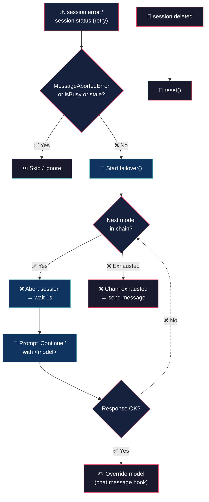

# Model Failover (never stop)


> Automatic model failover plugin for **OpenCode**. Detects any `session.error`
> (except `MessageAbortedError`) and switches the active session to the next model
> in a configured chain — transparently and unattended.

## 🔄 How it works



## 💡 What it does

- **Automatic failover** — detects `session.error` (all status codes), aborts the session, selects the next model in the chain, and re-prompts with "Continue." The new model takes over with the existing conversation context.

- **Cascade logic** — if a failover model also fails, the chain advances to the next available model. Every decision is logged. If the chain is exhausted, a clear "❌ Failover chain exhausted" message is sent.

- **Unattended** — no manual intervention required. Notifications appear in the output. `MessageAbortedError` is ignored — only real errors trigger the cascade.

## 🚀 Install

```bash
cp model-failover.ts ~/.config/opencode/plugins/model-failover.ts
```

No npm, no build step, no dependencies. OpenCode runs TypeScript natively.

## ⏹️ Disable

```bash
mv ~/.config/opencode/plugins/model-failover.ts{,.disabled}
```

Or set `"enabled": false` in the config.

## ⚙️ Configuration

`~/.config/opencode/model-failover.json`:

```json
{
	"enabled": true,
	"chain":
	[
		{ "model": "opencode-go/deepseek-v4-flash", "variant": "max" },
		{ "model": "opencode-go/deepseek-v4-pro", "variant": "medium" },
		{ "model": "deepseek/deepseek-v4-flash-free", "variant": "max" }
	],
	"log_level": "info"
}
```

| Option | Type | Default | Description |
|---|---|---|---|
| `enabled` | `boolean` | `true` | Master switch. |
| `chain` | `object[]` | `[]` | Ordered model entries `{ model, variant? }` where `model` is `"providerID/modelID"`. Variant can be `max`, `high`, `medium`, `low`, etc. |
| `log_level` | `string` | `"info"` | `"silent"`, `"error"`, `"info"`, or `"debug"`. |

## 🪵 Logs

`~/.config/opencode/model-failover.log` (append-only). Format: `[ISO_TIMESTAMP] [LEVEL] message`.

```bash
tail -f ~/.config/opencode/model-failover.log
```

## 📖 Behavior

| Event | Reaction |
|---|---|
| `session.error` (any status code) | Immediate failover — abort session, pick next model, re-prompt with "Continue." |
| Error during failover cascade | Handled inline by the for-loop (logged + next model). Stale `session.error` events dropped by `isBusy` guard. |
| `MessageAbortedError` | Ignored. |
| Failover `prompt()` fails | Error logged, cascade advances to the next model. |
| Chain exhausted | "❌ Failover chain exhausted" sent to session. |
| User switches model via `/models` | Respects user's choice; next `session.error` restarts cascade from the beginning. |

## 💬 Notes

Less is more. :)

## 👤 Authors

- Alejandro Carraretto
- DeepSeek-V4

## 📄 License

MIT — version 1.0.32
